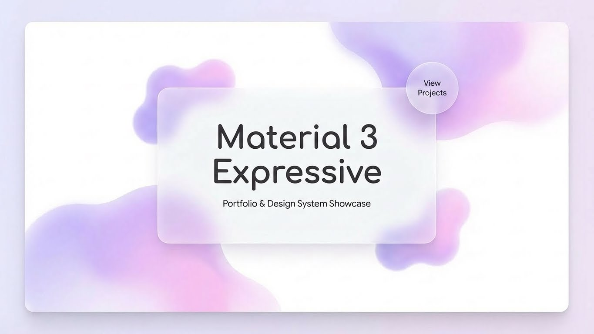

# Material 3 Expressive Portfolio



This is an open-source portfolio website built with Flutter, designed to showcase projects and skills with a modern, aesthetic appeal. It strictly follows **Google's Material 3 Expressive Design** language to ensure a premium and high-quality user experience.

🚀 **Live Demo**: [muditpurohit.tech](https://muditpurohit.tech)

---

## ✨ Features

- **Material 3 Expressive Design**: Vibrant colors, dynamic animations, and a modern UI.
- **Responsive Layout**: Optimized for Mobile, Tablet, and Desktop.
- **Supabase Backend**: Manages data for Skills, Experience, Projects, and Images.
- **Smooth Responsiveness**: Utilizing powerful packages for scaling and adaptation.

## 🛠️ Tech Stack

- **Framework**: [Flutter](https://flutter.dev/)
- **Backend**: [Supabase](https://supabase.com/)
- **Responsiveness**:
  - [Responsive Framework](https://pub.dev/packages/responsive_framework) for layout adaptation.
  - [Responsive Scaler](https://pub.dev/packages/responsive_scaler) (`responsive_scaler`) - My custom package for easy scaling.

## ⚙️ Configuration & Setup

To run this project locally, you need to configure the environment variables and set up the Supabase backend.

### 1. Environment Variables

Create a `.env` file in the root directory of the project and add the following keys:

```properties
SUPABASE_URL="your_supabase_url"
SUPABASE_ANON_KEY="your_supabase_anon_key"
PROFILE_URL="your_profile_url" // In Supabase Bucket
RESUME_URL="your_resume_url" // In Supabase Bucket
```

### 2. Supabase Setup

This project uses Supabase for the database and storage. structure your database by running the following SQL commands in your Supabase SQL Editor.

#### Skills Table

```sql
create table skills (
  skill_name text primary key
);

-- Enable Row Level Security
alter table skills enable row level security;

-- Create policy for public read access
create policy "Allow public read access" on skills
  for select using (true);
```

#### Experience Table

```sql
CREATE TABLE IF NOT EXISTS experience (
    id BIGINT GENERATED ALWAYS AS IDENTITY PRIMARY KEY,
    company_name TEXT NOT NULL,
    job_title TEXT NOT NULL,
    start_date TEXT NOT NULL,
    end_date TEXT,
    responsibilities JSONB NOT NULL,
    location TEXT NOT NULL,
    created_at TIMESTAMPTZ DEFAULT NOW(),
    order_position INT DEFAULT 0
);

-- Enable Row Level Security
alter table experience enable row level security;

-- Create policy for public read access
create policy "Allow public read access" on experience
  for select using (true);
```

#### Project Table

```sql
CREATE TABLE IF NOT EXISTS project (
    id BIGINT GENERATED ALWAYS AS IDENTITY PRIMARY KEY,
    title TEXT NOT NULL,
    description JSONB NOT NULL,
    tags JSONB NOT NULL,
    image TEXT NOT NULL,
    pubDev TEXT,
    github TEXT,
    created_at TIMESTAMPTZ DEFAULT NOW()
);

-- Enable Row Level Security
alter table project enable row level security;

-- Create policy for public read access
create policy "Allow public read access" on project
  for select using (true);
```

### 3. Storage

Create a **Storage Bucket** (e.g., named `portfolio-assets`) to store your project images, profile pic and resume pdf. Ensure the bucket is public or has appropriate policies for read access.

### 4. Contact Page Links

Open `lib/pages/contact_page.dart` and replace the placeholder values with your own:

```dart
final String _myEmail = '[EMAIL_ADDRESS]';   // Your email address
final String _githubUrl = '[GITHUB_URL]';     // Your GitHub profile URL
final String _linkedinUrl = '[LINKEDIN_URL]'; // Your LinkedIn profile URL
final String _accessKey = '[ACCESS_KEY]';     // Your Web3Forms access key
```

> You can get a free access key from [Web3Forms](https://web3forms.com/).

## 🚀 Running the Project

1.  **Clone the repository**:

    ```bash
    git clone https://github.com/Mudit200408/Material3E-Portfolio-Website
    ```

2.  **Install dependencies**:

    ```bash
    flutter pub get
    ```

3.  **Run the app**:
    ```bash
    flutter run
    ```
